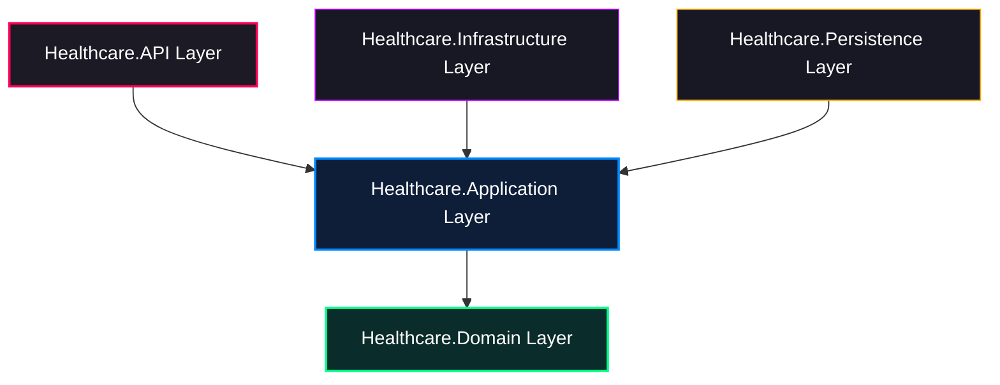

# Healthcare Assistance System - System Architecture Design
## Phase 1: Clean Architecture & .NET 9 Redesign

This document details the software architecture, design patterns, directory structure, request lifecycles, and code patterns for the Healthcare Assistance System. The system is designed using **Clean Architecture** combined with **Domain-Driven Design (DDD)** and **CQRS (Command Query Responsibility Segregation)** inside the Application Layer.

---

## 1. High-Level Architecture Design

The system is split into five main logical layers following the Clean Architecture paradigm. Dependency flow is strictly unidirectional, pointing inwards toward the Core Domain.



### Layer Responsibilities

1.  **Healthcare.Domain (Core Layer)**
    *   Contains enterprise-wide business rules, entities, value objects, domain events, domain exceptions, and repository interfaces.
    *   No external dependencies (no EF Core, no third-party libraries except system-level abstractions).
2.  **Healthcare.Application (Core Layer)**
    *   Contains application-specific business rules, CQRS commands/queries, handlers, validators, DTO mappings, and application service interfaces.
    *   Acts as the orchestrator of business use cases.
3.  **Healthcare.Persistence (Infrastructure Layer)**
    *   Handles database access using Entity Framework Core 9.
    *   Implements the concrete repository interfaces and Unit of Work, manages the database context (`ApplicationDbContext`), database migrations, and EF entity configurations.
4.  **Healthcare.Infrastructure (Infrastructure Layer)**
    *   Implements non-database technical details (email/SMS/push services, file system/cloud storage, AI client integrations, date-time providers).
5.  **Healthcare.API (Presentation Layer)**
    *   The entry point of the application (ASP.NET Core 9 Web API).
    *   Hosts REST Controllers, JWT middlewares, global exception handlers, OpenAPI/Swagger settings, and dependency injection registration.

---

## 2. Directory Structure

```
src/
├── Healthcare.Domain/
│   ├── Common/
│   │   ├── BaseEntity.cs
│   │   ├── ISoftDelete.cs
│   │   └── DomainEvent.cs
│   ├── Entities/
│   │   ├── User.cs
│   │   ├── Patient.cs
│   │   ├── Doctor.cs
│   │   ├── Appointment.cs
│   │   ├── Symptom.cs
│   │   ├── Message.cs
│   │   ├── AuditLog.cs
│   │   └── FileMetadata.cs
│   ├── Events/
│   │   ├── AppointmentBookedEvent.cs
│   │   ├── AppointmentCancelledEvent.cs
│   │   └── SymptomLoggedEvent.cs
│   ├── Exceptions/
│   │   └── DomainException.cs
│   └── ValueObjects/
│       └── MedicalHistory.cs
│
├── Healthcare.Application/
│   ├── Common/
│   │   ├── Behaviors/
│   │   │   ├── LoggingBehavior.cs
│   │   │   ├── ValidationBehavior.cs
│   │   │   └── TransactionBehavior.cs
│   │   ├── Interfaces/
│   │   │   ├── IApplicationDbContext.cs
│   │   │   ├── IDateTimeProvider.cs
│   │   │   ├── IEmailService.cs
│   │   │   ├── ISmsService.cs
│   │   │   ├── IPushService.cs
│   │   │   ├── IFileStorageService.cs
│   │   │   └── IAiTriageService.cs
│   │   └── Exceptions/
│   │       ├── ValidationException.cs
│   │       └── NotFoundException.cs
│   └── Features/
│       ├── Patients/
│       │   ├── Commands/
│       │   │   └── RegisterPatient/
│       │   │       ├── RegisterPatientCommand.cs
│       │   │       ├── RegisterPatientCommandValidator.cs
│       │   │       └── RegisterPatientCommandHandler.cs
│       │   └── Queries/
│       │       └── GetPatientProfile/
│       ├── Doctors/
│       │   └── Queries/
│       │       └── GetDoctorSchedule/
│       ├── Appointments/
│       │   ├── Commands/
│       │   │   └── BookAppointment/
│       │   │       ├── BookAppointmentCommand.cs
│       │   │       ├── BookAppointmentCommandValidator.cs
│       │   │       └── BookAppointmentCommandHandler.cs
│       │   └── Queries/
│       ├── Symptoms/
│       │   ├── Commands/
│       │   │   └── LogSymptom/
│       │   │       ├── LogSymptomCommand.cs
│       │   │       ├── LogSymptomCommandValidator.cs
│       │   │       └── LogSymptomCommandHandler.cs
│       │   └── Queries/
│       └── Authentication/
│           ├── Commands/
│           │   └── Login/
│
├── Healthcare.Persistence/
│   ├── Configurations/
│   │   ├── UserConfiguration.cs
│   │   ├── PatientConfiguration.cs
│   │   └── AppointmentConfiguration.cs
│   ├── Interceptors/
│   │   ├── AuditInterceptor.cs
│   │   └── SoftDeleteInterceptor.cs
│   ├── Repositories/
│   │   ├── Repository.cs
│   │   └── UnitOfWork.cs
│   ├── Migrations/
│   └── ApplicationDbContext.cs
│
├── Healthcare.Infrastructure/
│   ├── Services/
│   │   ├── EmailService.cs
│   │   ├── SmsService.cs
│   │   ├── PushService.cs
│   │   ├── LocalFileStorageService.cs
│   │   └── GeminiAiTriageService.cs
│   └── Identity/
│       └── PasswordHasher.cs
│
└── Healthcare.API/
    ├── Controllers/
    │   ├── ApiControllerBase.cs
    │   ├── PatientsController.cs
    │   ├── AppointmentsController.cs
    │   └── SymptomsController.cs
    ├── Middlewares/
    │   └── GlobalExceptionHandler.cs
    ├── Program.cs
    └── appsettings.json
```

---

## 3. Core Architectural Flows

### 3.1 Request Lifecycle & CQRS Flow
The API controllers inherit from `ApiControllerBase` which holds a reference to MediatR's `ISender`.

```
[HTTP Request] 
      │
      ▼
[Healthcare.API Controller]
      │  (Dispatches Command or Query)
      ▼
[MediatR Pipeline Behaviors]
      │  (Logging -> Validation -> Database Transaction)
      ▼
[CQRS Handler (Application Layer)]
      │  (Executes business rules, loads entities)
      ▼
[Domain Entity Logic]
      │  (Updates states, raises Domain Events)
      ▼
[EF Core SaveChanges]
      │  (Interceptors process Audits and Soft Deletes)
      ▼
[Database Commit]
      │
      ▼
[Publish Domain Events] 
      │  (Async execution of notification/messaging handlers)
      ▼
[API response (ProblemDetails or DTO)]
```

### 3.2 Authentication & Authorization Flow
1.  **Identity Handshake:** The client sends credentials to `/api/v1/auth/login`.
2.  **Validation:** The handler validates the password hash, generates a secure, cryptographically random Refresh Token (saved to database), and signs a JWT Access Token.
3.  **Claims Structure:** The JWT contains user identification claims (`sub`, `email`, `role`, `permissions`).
4.  **Authorization Interception:** The client attaches `Authorization: Bearer <token>` to headers. The ASP.NET Core Authentication Middleware validates the token signature and expiration.
5.  **RBAC Verification:** Controller routes or handlers are marked with `[Authorize(Roles = "Doctor")]` or custom policy assertions.

### 3.3 Database Interaction Flow (EF Core Interceptors)
*   **Audit Logging:** An EF Core `SaveChangesInterceptor` inspects the Change Tracker before committing. For every added or modified entity implementing `IAuditable`, it injects user claims data (current User UUID via an `ICurrentUserService` interface) into `CreatedAt`/`UpdatedAt` and `CreatedBy`/`UpdatedBy`. Additionally, it writes state differences (JSON values) directly into the `AuditLogs` table.
*   **Soft Delete:** The query filters are automatically bound in `OnModelCreating` using EF Core metadata configurations. The `SoftDeleteInterceptor` intercepts deletions and updates `IsDeleted = true`, `DeletedAt = DateTime.UtcNow`, and `DeletedBy = currentUser` instead of emitting a database `DELETE` statement.

### 3.4 AI Module Integration Flow
*   The `IAiTriageService` defines the triage interface. The Infrastructure layer implements this using an external HTTP client calling Google Gemini (or a custom deployment).
*   **Execution Isolation:** The API controller dispatches a symptom log command. The command handler calls `IAiTriageService.AssessSymptomsAsync(symptoms)`. If the request fails or times out, the handler gracefully logs a fallback severity rating and schedules an offline retry or flags the entry as `PendingTriage`.

### 3.5 Notification Flow
*   When commands complete, entities call `.AddDomainEvent(new AppointmentBookedEvent(...))`.
*   Post-database transaction, MediatR publishes these events to concrete async handlers (e.g., `AppointmentBookedNotificationHandler`).
*   The handlers use `IEmailService`, `ISmsService`, or `IPushService` to queue or push direct updates to the target user.

### 3.6 Logging & Error Handling Flow
*   **Logging:** Serilog is configured to capture structured JSON logs containing correlation IDs. Exception logs output detailed parameters, omitting sensitive user-PII where restricted.
*   **Global Exception Handling:** A middleware utilizing `.NET 9's IExceptionHandler` intercepts all unhandled errors, transforming custom application exceptions (like `NotFoundException` or `ValidationException`) into RFC 7807 compliant `ProblemDetails` JSON representations.

---

## 4. CQRS Implementation Examples

Here are the complete, production-grade implementations of the CQRS patterns within the `Healthcare.Application` layer.

### 4.1 Shared Abstractions (Domain Layer)

```csharp
namespace Healthcare.Domain.Common;

public abstract class BaseEntity
{
    public Guid Id { get; set; } = Guid.NewGuid();
    public DateTime CreatedAt { get; set; } = DateTime.UtcNow;
    public Guid? CreatedBy { get; set; }
    public DateTime? UpdatedAt { get; set; }
    public Guid? UpdatedBy { get; set; }
    
    private readonly List<DomainEvent> _domainEvents = new();
    public IReadOnlyCollection<DomainEvent> DomainEvents => _domainEvents.AsReadOnly();

    public void AddDomainEvent(DomainEvent domainEvent) => _domainEvents.Add(domainEvent);
    public void ClearDomainEvents() => _domainEvents.Clear();
}

public interface ISoftDelete
{
    public bool IsDeleted { get; set; }
    public DateTime? DeletedAt { get; set; }
    public Guid? DeletedBy { get; set; }
}

public abstract class DomainEvent
{
    public DateTime DateOccurred { get; protected set; } = DateTime.UtcNow;
}
```

### 4.2 Module 1: Patient Registration (Authentication & Patient Management)

#### Command
```csharp
using MediatR;

namespace Healthcare.Application.Features.Patients.Commands.RegisterPatient;

public record RegisterPatientCommand(
    string Email,
    string Password,
    string FirstName,
    string LastName,
    DateTime DateOfBirth,
    string PhoneNumber,
    string BiologicalSex,
    string BloodType,
    string EmergencyContactName,
    string EmergencyContactPhone
) : IRequest<Guid>;
```

#### Validator
```csharp
using FluentValidation;

namespace Healthcare.Application.Features.Patients.Commands.RegisterPatient;

public class RegisterPatientCommandValidator : AbstractValidator<RegisterPatientCommand>
{
    public RegisterPatientCommandValidator()
    {
        RuleFor(x => x.Email)
            .NotEmpty().WithMessage("Email is required.")
            .EmailAddress().WithMessage("Invalid email format.");

        RuleFor(x => x.Password)
            .NotEmpty().WithMessage("Password is required.")
            .MinimumLength(8).WithMessage("Password must be at least 8 characters long.")
            .Matches(@"[A-Z]").WithMessage("Password must contain at least one uppercase letter.")
            .Matches(@"[a-z]").WithMessage("Password must contain at least one lowercase letter.")
            .Matches(@"[0-9]").WithMessage("Password must contain at least one digit.")
            .Matches(@"[\!\?\*\.]").WithMessage("Password must contain at least one special character (!, ?, *, .).");

        RuleFor(x => x.FirstName)
            .NotEmpty().WithMessage("First name is required.")
            .MaximumLength(50).WithMessage("First name must not exceed 50 characters.");

        RuleFor(x => x.LastName)
            .NotEmpty().WithMessage("Last name is required.")
            .MaximumLength(50).WithMessage("Last name must not exceed 50 characters.");

        RuleFor(x => x.DateOfBirth)
            .NotEmpty().WithMessage("Date of birth is required.")
            .Must(dob => dob <= DateTime.Today.AddYears(-18))
            .WithMessage("Patient must be at least 18 years old.");

        RuleFor(x => x.PhoneNumber)
            .NotEmpty().WithMessage("Phone number is required.")
            .Matches(@"^\+[1-9]\d{1,14}$").WithMessage("Invalid phone number format. Must use E.164 (e.g. +1234567890).");

        RuleFor(x => x.BiologicalSex)
            .NotEmpty().WithMessage("Biological sex is required.")
            .Must(sex => sex == "Male" || sex == "Female" || sex == "Other")
            .WithMessage("Biological sex must be Male, Female, or Other.");
    }
}
```

#### DTO & Handler
```csharp
using MediatR;
using Healthcare.Domain.Entities;
using Healthcare.Application.Common.Interfaces;
using Healthcare.Application.Common.Exceptions;

namespace Healthcare.Application.Features.Patients.Commands.RegisterPatient;

public class RegisterPatientCommandHandler : IRequestHandler<RegisterPatientCommand, Guid>
{
    private readonly IApplicationDbContext _context;
    private readonly IDateTimeProvider _dateTime;

    public RegisterPatientCommandHandler(IApplicationDbContext context, IDateTimeProvider dateTime)
    {
        _context = context;
        _dateTime = dateTime;
    }

    public async Task<Guid> Handle(RegisterPatientCommand request, CancellationToken cancellationToken)
    {
        // Check uniqueness of Email
        var emailExists = _context.Users.Any(u => u.Email.ToLower() == request.Email.ToLower());
        if (emailExists)
        {
            throw new ValidationException(new[] { 
                new ValidationError("Email", "A user with this email address already exists.") 
            });
        }

        // 1. Create Identity User
        var user = new User
        {
            Email = request.Email,
            PasswordHash = BCrypt.Net.BCrypt.HashPassword(request.Password), // Example hashing
            Role = "Patient",
            IsEmailVerified = false,
            VerificationToken = Guid.NewGuid().ToString(),
            CreatedAt = _dateTime.UtcNow
        };

        _context.Users.Add(user);

        // 2. Create Patient Entity
        var patient = new Patient
        {
            UserId = user.Id,
            FirstName = request.FirstName,
            LastName = request.LastName,
            DateOfBirth = request.DateOfBirth,
            PhoneNumber = request.PhoneNumber,
            BiologicalSex = request.BiologicalSex,
            BloodType = request.BloodType,
            EmergencyContactName = request.EmergencyContactName,
            EmergencyContactPhone = request.EmergencyContactPhone,
            CreatedAt = _dateTime.UtcNow
        };

        _context.Patients.Add(patient);

        await _context.SaveChangesAsync(cancellationToken);

        return patient.Id;
    }
}
```

---

### 4.2 Module 2: Booking an Appointment

#### Command
```csharp
using MediatR;

namespace Healthcare.Application.Features.Appointments.Commands.BookAppointment;

public record BookAppointmentCommand(
    Guid PatientId,
    Guid DoctorId,
    DateTime AppointmentDate,
    int DurationMinutes,
    string Reason
) : IRequest<Guid>;
```

#### Validator
```csharp
using FluentValidation;

namespace Healthcare.Application.Features.Appointments.Commands.BookAppointment;

public class BookAppointmentCommandValidator : AbstractValidator<BookAppointmentCommand>
{
    public BookAppointmentCommandValidator()
    {
        RuleFor(x => x.PatientId).NotEmpty().WithMessage("Patient ID is required.");
        RuleFor(x => x.DoctorId).NotEmpty().WithMessage("Doctor ID is required.");
        
        RuleFor(x => x.AppointmentDate)
            .NotEmpty().WithMessage("Appointment date is required.")
            .Must(date => date > DateTime.UtcNow.AddHours(2))
            .WithMessage("Appointments must be booked at least 2 hours in advance.");

        RuleFor(x => x.DurationMinutes)
            .Must(duration => duration == 15 || duration == 30 || duration == 45 || duration == 60)
            .WithMessage("Duration must be 15, 30, 45, or 60 minutes.");

        RuleFor(x => x.Reason)
            .NotEmpty().WithMessage("Reason for appointment is required.")
            .MinimumLength(10).WithMessage("Please provide a more descriptive reason (min 10 characters).")
            .MaximumLength(500).WithMessage("Reason must not exceed 500 characters.");
    }
}
```

#### Handler
```csharp
using MediatR;
using Healthcare.Domain.Entities;
using Healthcare.Domain.Events;
using Healthcare.Application.Common.Interfaces;
using Healthcare.Application.Common.Exceptions;
using Microsoft.EntityFrameworkCore;

namespace Healthcare.Application.Features.Appointments.Commands.BookAppointment;

public class BookAppointmentCommandHandler : IRequestHandler<BookAppointmentCommand, Guid>
{
    private readonly IApplicationDbContext _context;
    private readonly IDateTimeProvider _dateTime;

    public BookAppointmentCommandHandler(IApplicationDbContext context, IDateTimeProvider dateTime)
    {
        _context = context;
        _dateTime = dateTime;
    }

    public async Task<Guid> Handle(BookAppointmentCommand request, CancellationToken cancellationToken)
    {
        // 1. Verify patient existence
        var patientExists = await _context.Patients.AnyAsync(p => p.Id == request.PatientId, cancellationToken);
        if (!patientExists)
            throw new NotFoundException(nameof(Patient), request.PatientId);

        // 2. Verify doctor availability and existence
        var doctor = await _context.Doctors
            .FirstOrDefaultAsync(d => d.Id == request.DoctorId && d.IsVerified, cancellationToken);
        if (doctor == null)
            throw new NotFoundException(nameof(Doctor), request.DoctorId);

        // 3. Prevent double-booking / check overlapping slots
        var endDateTime = request.AppointmentDate.AddMinutes(request.DurationMinutes);
        var isSlotTaken = await _context.Appointments
            .AnyAsync(a => a.DoctorId == request.DoctorId 
                           && a.Status != "Cancelled" 
                           && a.AppointmentDate < endDateTime 
                           && a.AppointmentDate.AddMinutes(a.DurationMinutes) > request.AppointmentDate, 
                      cancellationToken);

        if (isSlotTaken)
        {
            throw new ValidationException(new[] { 
                new ValidationError("AppointmentDate", "The requested timeslot is already reserved.") 
            });
        }

        // 4. Instantiate and persist Appointment
        var appointment = new Appointment
        {
            PatientId = request.PatientId,
            DoctorId = request.DoctorId,
            AppointmentDate = request.AppointmentDate,
            DurationMinutes = request.DurationMinutes,
            Reason = request.Reason,
            Status = "Booked",
            CreatedAt = _dateTime.UtcNow
        };

        // Raise Domain Event
        appointment.AddDomainEvent(new AppointmentBookedEvent(appointment));

        _context.Appointments.Add(appointment);
        await _context.SaveChangesAsync(cancellationToken);

        return appointment.Id;
    }
}
```

---

### 4.3 Module 3: Symptom Logging (AI Triage Flow)

#### Command
```csharp
using MediatR;

namespace Healthcare.Application.Features.Symptoms.Commands.LogSymptom;

public record LogSymptomCommand(
    Guid PatientId,
    string Description,
    int SeverityScale, // 1 - 10
    DateTime LoggedAt
) : IRequest<Guid>;
```

#### Validator
```csharp
using FluentValidation;

namespace Healthcare.Application.Features.Symptoms.Commands.LogSymptom;

public class LogSymptomCommandValidator : AbstractValidator<LogSymptomCommand>
{
    public LogSymptomCommandValidator()
    {
        RuleFor(x => x.PatientId).NotEmpty();
        RuleFor(x => x.Description)
            .NotEmpty().WithMessage("Symptom description is required.")
            .MaximumLength(1000).WithMessage("Description length must not exceed 1000 characters.");
        
        RuleFor(x => x.SeverityScale)
            .InclusiveBetween(1, 10).WithMessage("Severity scale must be between 1 and 10.");

        RuleFor(x => x.LoggedAt)
            .LessThanOrEqualTo(DateTime.UtcNow).WithMessage("Logged time cannot be in the future.");
    }
}
```

#### Handler
```csharp
using MediatR;
using Healthcare.Domain.Entities;
using Healthcare.Domain.Events;
using Healthcare.Application.Common.Interfaces;
using Healthcare.Application.Common.Exceptions;
using Microsoft.EntityFrameworkCore;

namespace Healthcare.Application.Features.Symptoms.Commands.LogSymptom;

public class LogSymptomCommandHandler : IRequestHandler<LogSymptomCommand, Guid>
{
    private readonly IApplicationDbContext _context;
    private readonly IAiTriageService _aiService;
    private readonly IDateTimeProvider _dateTime;

    public LogSymptomCommandHandler(IApplicationDbContext context, IAiTriageService aiService, IDateTimeProvider dateTime)
    {
        _context = context;
        _aiService = aiService;
        _dateTime = dateTime;
    }

    public async Task<Guid> Handle(LogSymptomCommand request, CancellationToken cancellationToken)
    {
        var patient = await _context.Patients
            .AnyAsync(p => p.Id == request.PatientId, cancellationToken);
            
        if (!patient)
            throw new NotFoundException(nameof(Patient), request.PatientId);

        // 1. Invoke Isolated AI Service for triage assessment
        string aiTriageResult;
        string aiRecommendation;
        
        try
        {
            var analysis = await _aiService.AssessSymptomsAsync(request.Description, cancellationToken);
            aiTriageResult = analysis.SeverityLevel; // Low, Medium, High
            aiRecommendation = analysis.Recommendation;
        }
        catch (Exception)
        {
            // Fallback strategy if AI module is offline
            aiTriageResult = "PendingTriage";
            aiRecommendation = "AI triage engine is currently evaluating your symptoms. A medical agent will verify shortly.";
        }

        // 2. Create entity record
        var symptom = new Symptom
        {
            PatientId = request.PatientId,
            Description = request.Description,
            SeverityScale = request.SeverityScale,
            AiTriageResult = aiTriageResult,
            AiRecommendation = aiRecommendation,
            LoggedAt = request.LoggedAt,
            CreatedAt = _dateTime.UtcNow
        };

        symptom.AddDomainEvent(new SymptomLoggedEvent(symptom));

        _context.Symptoms.Add(symptom);
        await _context.SaveChangesAsync(cancellationToken);

        return symptom.Id;
    }
}
```

---

### 4.4 Module 4: Get Doctor Schedule (Query Operations)

#### Query & DTO
```csharp
using MediatR;

namespace Healthcare.Application.Features.Doctors.Queries.GetDoctorSchedule;

public record GetDoctorScheduleQuery(
    Guid DoctorId,
    DateTime Date
) : IRequest<DoctorScheduleDto>;

public record DoctorScheduleDto(
    Guid DoctorId,
    string DoctorName,
    DateTime QueryDate,
    List<TimeSlotDto> TimeSlots
);

public record TimeSlotDto(
    DateTime StartTime,
    DateTime EndTime,
    bool IsBooked,
    Guid? AppointmentId
);
```

#### Query Handler
```csharp
using MediatR;
using Healthcare.Application.Common.Interfaces;
using Healthcare.Application.Common.Exceptions;
using Microsoft.EntityFrameworkCore;

namespace Healthcare.Application.Features.Doctors.Queries.GetDoctorSchedule;

public class GetDoctorScheduleQueryHandler : IRequestHandler<GetDoctorScheduleQuery, DoctorScheduleDto>
{
    private readonly IApplicationDbContext _context;

    public GetDoctorScheduleQueryHandler(IApplicationDbContext context)
    {
        _context = context;
    }

    public async Task<DoctorScheduleDto> Handle(GetDoctorScheduleQuery request, CancellationToken cancellationToken)
    {
        var doctor = await _context.Doctors
            .Include(d => d.User)
            .FirstOrDefaultAsync(d => d.Id == request.DoctorId, cancellationToken);

        if (doctor == null)
            throw new NotFoundException(nameof(Doctor), request.DoctorId);

        // Define search range boundaries (local daily bounds)
        var startRange = request.Date.Date;
        var endRange = startRange.AddDays(1);

        // Fetch booked appointments for this day
        var bookedAppointments = await _context.Appointments
            .Where(a => a.DoctorId == request.DoctorId 
                        && a.Status != "Cancelled" 
                        && a.AppointmentDate >= startRange 
                        && a.AppointmentDate < endRange)
            .ToListAsync(cancellationToken);

        // Generate static slots (Example: 9:00 AM - 5:00 PM, 30 min increments)
        var slots = new List<TimeSlotDto>();
        var currentSlotStart = startRange.AddHours(9); // Start of workday
        var workdayEnd = startRange.AddHours(17);     // End of workday

        while (currentSlotStart < workdayEnd)
        {
            var currentSlotEnd = currentSlotStart.AddMinutes(30);
            
            // Check if slot overlaps with any active bookings
            var booking = bookedAppointments.FirstOrDefault(a => 
                a.AppointmentDate < currentSlotEnd && 
                a.AppointmentDate.AddMinutes(a.DurationMinutes) > currentSlotStart);

            slots.Add(new TimeSlotDto(
                currentSlotStart,
                currentSlotEnd,
                IsBooked: booking != null,
                AppointmentId: booking?.Id
            ));

            currentSlotStart = currentSlotEnd;
        }

        return new DoctorScheduleDto(
            DoctorId: doctor.Id,
            DoctorName: $"{doctor.FirstName} {doctor.LastName}",
            QueryDate: request.Date,
            TimeSlots: slots
        );
    }
}
```
