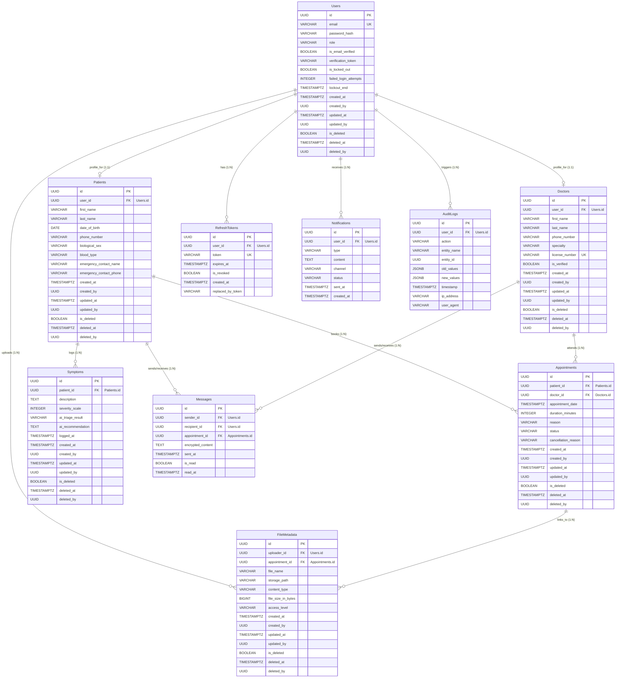

# Healthcare Assistance System - Database Model & ERD
## Phase 1: Entity-Relationship Diagram & Table Specifications

This document defines the relational database model designed for PostgreSQL. It guarantees strict auditing, soft deletes, security structures, UUID utilization, and comprehensive indexing.

---

## 1. High-Level Entity Relationship Diagram (Mermaid)



---

## 2. Relational Table Mapping & Constraints

### 2.1 Table: `Users`
Base authentication and authorization credential record.

*   **PrimaryKey:** `id` (UUID, Default: `gen_random_uuid()`)
*   **Columns & Constraints:**
    *   `email` (VARCHAR(255), UNIQUE, NOT NULL, Lowercase conversion index)
    *   `password_hash` (VARCHAR(255), NOT NULL)
    *   `role` (VARCHAR(50), NOT NULL) - Check Constraint: `role IN ('Patient', 'Doctor', 'Admin')`
    *   `is_email_verified` (BOOLEAN, NOT NULL, Default: `FALSE`)
    *   `verification_token` (VARCHAR(255), NULL)
    *   `is_locked_out` (BOOLEAN, NOT NULL, Default: `FALSE`)
    *   `failed_login_attempts` (INTEGER, NOT NULL, Default: `0`)
    *   `lockout_end` (TIMESTAMPTZ, NULL)
    *   *Standard Audit & Soft Delete Columns*

### 2.2 Table: `Patients`
Clinical demographic records linked to a patient profile user.

*   **PrimaryKey:** `id` (UUID, Default: `gen_random_uuid()`)
*   **Columns & Constraints:**
    *   `user_id` (UUID, UNIQUE, NOT NULL, Foreign Key to `Users.id` ON DELETE CASCADE)
    *   `first_name` (VARCHAR(50), NOT NULL)
    *   `last_name` (VARCHAR(50), NOT NULL)
    *   `date_of_birth` (DATE, NOT NULL)
    *   `phone_number` (VARCHAR(20), NOT NULL)
    *   `biological_sex` (VARCHAR(10), NOT NULL) - Check: `biological_sex IN ('Male', 'Female', 'Other')`
    *   `blood_type` (VARCHAR(5), NULL)
    *   `emergency_contact_name` (VARCHAR(100), NOT NULL)
    *   `emergency_contact_phone` (VARCHAR(20), NOT NULL)
    *   *Standard Audit & Soft Delete Columns*

### 2.3 Table: `Doctors`
Clinical credentials and identification records linked to a doctor profile user.

*   **PrimaryKey:** `id` (UUID, Default: `gen_random_uuid()`)
*   **Columns & Constraints:**
    *   `user_id` (UUID, UNIQUE, NOT NULL, Foreign Key to `Users.id` ON DELETE CASCADE)
    *   `first_name` (VARCHAR(50), NOT NULL)
    *   `last_name` (VARCHAR(50), NOT NULL)
    *   `phone_number` (VARCHAR(20), NOT NULL)
    *   `specialty` (VARCHAR(100), NOT NULL)
    *   `license_number` (VARCHAR(100), UNIQUE, NOT NULL)
    *   `is_verified` (BOOLEAN, NOT NULL, Default: `FALSE`)
    *   *Standard Audit & Soft Delete Columns*

### 2.4 Table: `Appointments`
State-machine representations of booked physical or virtual encounters.

*   **PrimaryKey:** `id` (UUID, Default: `gen_random_uuid()`)
*   **Columns & Constraints:**
    *   `patient_id` (UUID, NOT NULL, Foreign Key to `Patients.id` ON DELETE RESTRICT)
    *   `doctor_id` (UUID, NOT NULL, Foreign Key to `Doctors.id` ON DELETE RESTRICT)
    *   `appointment_date` (TIMESTAMPTZ, NOT NULL)
    *   `duration_minutes` (INTEGER, NOT NULL) - Check: `duration_minutes IN (15, 30, 45, 60)`
    *   `reason` (VARCHAR(500), NOT NULL)
    *   `status` (VARCHAR(50), NOT NULL, Default: `'Booked'`) - Check: `status IN ('Booked', 'Confirmed', 'Cancelled', 'Completed', 'NoShow')`
    *   `cancellation_reason` (VARCHAR(500), NULL)
    *   *Standard Audit & Soft Delete Columns*

### 2.5 Table: `Symptoms`
Chronological logs of patient symptoms verified by AI triage modules.

*   **PrimaryKey:** `id` (UUID, Default: `gen_random_uuid()`)
*   **Columns & Constraints:**
    *   `patient_id` (UUID, NOT NULL, Foreign Key to `Patients.id` ON DELETE CASCADE)
    *   `description` (TEXT, NOT NULL)
    *   `severity_scale` (INTEGER, NOT NULL) - Check: `severity_scale BETWEEN 1 AND 10`
    *   `ai_triage_result` (VARCHAR(50), NOT NULL) - Check: `ai_triage_result IN ('Low', 'Medium', 'High', 'PendingTriage')`
    *   `ai_recommendation` (TEXT, NULL)
    *   `logged_at` (TIMESTAMPTZ, NOT NULL)
    *   *Standard Audit & Soft Delete Columns*

### 2.6 Table: `Messages`
Secure chat logging system linking patients and doctors directly.

*   **PrimaryKey:** `id` (UUID, Default: `gen_random_uuid()`)
*   **Columns & Constraints:**
    *   `sender_id` (UUID, NOT NULL, Foreign Key to `Users.id` ON DELETE RESTRICT)
    *   `recipient_id` (UUID, NOT NULL, Foreign Key to `Users.id` ON DELETE RESTRICT)
    *   `appointment_id` (UUID, NOT NULL, Foreign Key to `Appointments.id` ON DELETE CASCADE)
    *   `encrypted_content` (TEXT, NOT NULL)
    *   `sent_at` (TIMESTAMPTZ, NOT NULL, Default: `CURRENT_TIMESTAMP`)
    *   `is_read` (BOOLEAN, NOT NULL, Default: `FALSE`)
    *   `read_at` (TIMESTAMPTZ, NULL)

### 2.7 Table: `RefreshTokens`
Cryptographic entities driving JWT access rotation.

*   **PrimaryKey:** `id` (UUID, Default: `gen_random_uuid()`)
*   **Columns & Constraints:**
    *   `user_id` (UUID, NOT NULL, Foreign Key to `Users.id` ON DELETE CASCADE)
    *   `token` (VARCHAR(255), UNIQUE, NOT NULL)
    *   `expires_at` (TIMESTAMPTZ, NOT NULL)
    *   `is_revoked` (BOOLEAN, NOT NULL, Default: `FALSE`)
    *   `created_at` (TIMESTAMPTZ, NOT NULL, Default: `CURRENT_TIMESTAMP`)
    *   `replaced_by_token` (VARCHAR(255), NULL)

### 2.8 Table: `Notifications`
Queue table managing asynchronous mail, sms, and push execution tracking.

*   **PrimaryKey:** `id` (UUID, Default: `gen_random_uuid()`)
*   **Columns & Constraints:**
    *   `user_id` (UUID, NOT NULL, Foreign Key to `Users.id` ON DELETE CASCADE)
    *   `type` (VARCHAR(100), NOT NULL) (e.g. 'AppointmentConfirmation')
    *   `content` (TEXT, NOT NULL)
    *   `channel` (VARCHAR(50), NOT NULL) - Check: `channel IN ('Email', 'SMS', 'Push')`
    *   `status` (VARCHAR(50), NOT NULL, Default: `'Pending'`) - Check: `status IN ('Pending', 'Sent', 'Failed')`
    *   `sent_at` (TIMESTAMPTZ, NULL)
    *   `created_at` (TIMESTAMPTZ, NOT NULL, Default: `CURRENT_TIMESTAMP`)

### 2.9 Table: `AuditLogs`
System logging tracking target state modifications. No soft deletes are applied to audit records.

*   **PrimaryKey:** `id` (UUID, Default: `gen_random_uuid()`)
*   **Columns & Constraints:**
    *   `user_id` (UUID, NULL, Foreign Key to `Users.id` ON DELETE SET NULL)
    *   `action` (VARCHAR(100), NOT NULL)
    *   `entity_name` (VARCHAR(100), NOT NULL)
    *   `entity_id` (UUID, NOT NULL)
    *   `old_values` (JSONB, NULL)
    *   `new_values` (JSONB, NULL)
    *   `timestamp` (TIMESTAMPTZ, NOT NULL, Default: `CURRENT_TIMESTAMP`)
    *   `ip_address` (VARCHAR(45), NULL)
    *   `user_agent` (VARCHAR(255), NULL)

### 2.10 Table: `FileMetadata`
Secure identification record metadata pointing to private application files.

*   **PrimaryKey:** `id` (UUID, Default: `gen_random_uuid()`)
*   **Columns & Constraints:**
    *   `uploader_id` (UUID, NOT NULL, Foreign Key to `Users.id` ON DELETE RESTRICT)
    *   `appointment_id` (UUID, NULL, Foreign Key to `Appointments.id` ON DELETE SET NULL)
    *   `file_name` (VARCHAR(255), NOT NULL)
    *   `storage_path` (VARCHAR(512), NOT NULL)
    *   `content_type` (VARCHAR(100), NOT NULL)
    *   `file_size_in_bytes` (BIGINT, NOT NULL)
    *   `access_level` (VARCHAR(50), NOT NULL, Default: `'Private'`) - Check: `access_level IN ('Private', 'SharedWithDoctor', 'Public')`
    *   *Standard Audit & Soft Delete Columns*

---

## 3. Database Indexes

To guarantee high scalability and indexing optimization under load, the following indices are created:

```sql
-- Indexes for performance tuning
CREATE INDEX IX_Users_Email ON Users(email) WHERE is_deleted = FALSE;
CREATE INDEX IX_Appointments_Date ON Appointments(appointment_date) WHERE is_deleted = FALSE;
CREATE INDEX IX_Appointments_Doctor ON Appointments(doctor_id) WHERE is_deleted = FALSE;
CREATE INDEX IX_Appointments_Patient ON Appointments(patient_id) WHERE is_deleted = FALSE;
CREATE INDEX IX_Symptoms_LoggedAt ON Symptoms(logged_at) WHERE is_deleted = FALSE;
CREATE INDEX IX_Symptoms_Patient ON Symptoms(patient_id) WHERE is_deleted = FALSE;
CREATE INDEX IX_Messages_Appointment ON Messages(appointment_id);
CREATE INDEX IX_AuditLogs_Timestamp ON AuditLogs(timestamp);
CREATE INDEX IX_Notifications_Status ON Notifications(status);
CREATE INDEX IX_RefreshTokens_Token ON RefreshTokens(token);
```
